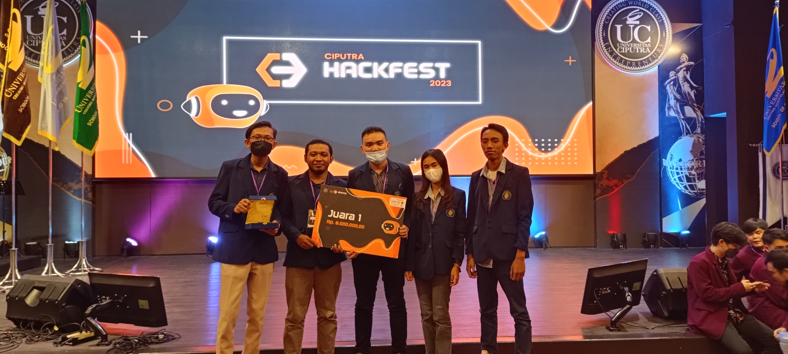

# Hackfest Ciputra 2023

## The Champion of Hackfest Ciputra 2023

Team Photo :


<strong>Team Name</strong>
   - Putu Ayu Ananda (Product Manager)
   - Ferdiansah Dwika Permana (Product Designer)
   - Fahmi Noordin Rumagutawan (Front End)
   - Ida Bagus (Front End)
   - Aditya Rizky Ramadhan (Backend & devops)

<strong>FrontEnd Repository</strong>
```
https://github.com/fahmirumagutawan/Jetpack-CiputraHackfest-2023
```

### Tech Stack :
1. Framework RestAPI : Gin
2. ORM : Gorm
3. Other library :
   - jinzhu/copier
   - gofrs/uuid
   - gin-contrib/timeout
   - golang-jwt/jwt/v4
   - adityarizkyramadhan/supabase-storage-uploader
   - sashabaranov/go-openai
   - xendit/xendit-go
4. Docker
5. let's encrypt
6. VM Ubuntu 22.04 LTS


### How to run in local :

Copy .env.example to .env and fill it
```
cp .env.example .env
sudo nano .env
```

Command to build all services in the docker-compose.yml file :
```
docker-compose build
```

Command to run all the services listed in the docker-compose.yml file in background mode :
```
docker compose up -d
```

API Online : https://hackfest.adityaariizkyy.my.id

Checkhealth : https://hackfest.adityaariizkyy.my.id/health

Documentation Postman : https://documenter.getpostman.com/view/19202594/2s93ecwq1v
